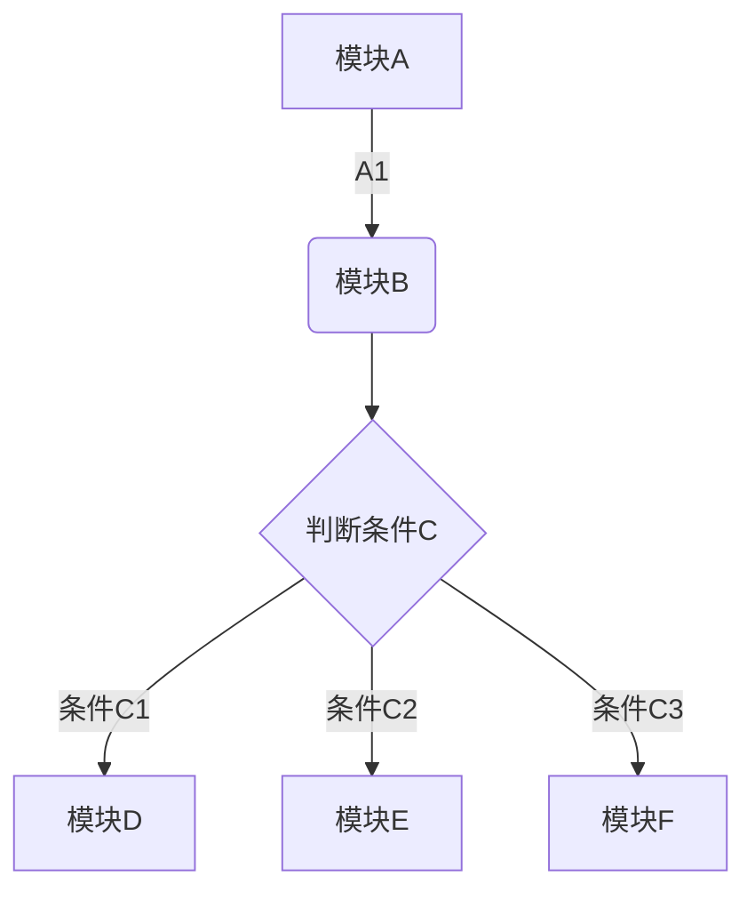

# zobolのOpenGL+QT教学笔记

#### 写作前言
   [ 偶遇图形学](./Doc/00AuthorForeword/01AuthorIntroduceWangShiRuYan.html)  

   [ 什么才是勇气？](./Doc/00AuthorForeword/02PearlOfSoftwareEngineering.html)


#### 1.总述  
* [1](./Doc/01.html)  
* [2](./Doc/02.html)  
* [3](./Doc/03.html)  
* [4](./Doc/04.html)  
* [5](./Doc/05.html)  
* [6](./Doc/06.html)  
* [7](./Doc/07.html)  
* [8](./Doc/08.html)  
* [9](./Doc/09.html)  
* [10](./Doc/10.html)  
* [11](./Doc/11.html)  
* [12](./Doc/12.html)  
* [13](./Doc/13.html)  
* [14](./Doc/14.html)  
* [15](./Doc/15.html)  
* [16](./Doc/16.html)  
* [17](./Doc/17.html)  
* [18](./Doc/18.html)  
* [19](./Doc/19.html)  
* [20](./Doc/20.html)  
* [21](./Doc/21.html)  
* [22](./Doc/22.html)  
* [23](./Doc/23.html)  
* [24](./Doc/24.html)  
* [25](./Doc/25.html)  
* [26](./Doc/26.html)  

* [1.2 操作系统的第二个功能——并发功能](./Doc/01Summary/0002TheSecondFunctionConcurrentFunction.html)  
	* 1.2.1 是多少都是
* [1.3 操作系统的第三个功能——存储管理功能](./Doc/01Summary/0003TheThirdFunctionIsStorageManagement.html)  

* [1.4 操作系统的其余功能](./Doc/01Summary/0004.html)  


   [1.2 怎么评价一个计算机网络的好坏？性能指标](./Doc/01Summary/0002TheSecondFunctionConcurrentFunction.html)

   [1.2 怎么评价一个计算机网络的好坏？性能指标](./Doc/01Summary/0002TheSecondFunctionConcurrentFunction.html)

   [1.2 怎么评价一个计算机网络的好坏？性能指标](./Doc/01Summary/0002TheSecondFunctionConcurrentFunction.html)

   [1.2 怎么评价一个计算机网络的好坏？性能指标](./Doc/01Summary/0002TheSecondFunctionConcurrentFunction.html)

#### 2.进程和线程

* [2.1 动为进程，静为程序 - 进程概论](./Doc/02/0001.html)

* [2.2 追求并发的极致-线程概论](./Doc/02/0002.html)
	* [2.2.1 用户态、内核态的形成](./Doc/02/00021.html)

   [3.2 物理层是做什么的？](b.html)

#### 2.数据链路层
#### 3.网络层
#### 4.传输层
#### 5.应用层


和无序列表一样，有序列表也有多级结构。
#### 语法
```
1. 这是一级的有序列表，数字1还是1
   1. 这是二级的有序列表，阿拉伯数字在显示的时候变成了罗马数字
      1. 这是三级的有序列表，数字在显示的时候变成了英文字母
```

#### 效果

1. 这是一级的有序列表，数字1还是1
   1.1 这是二级的有序列表，阿拉伯数字在显示的时候变成了罗马数字
      1.1.1 这是三级的有序列表，数字在显示的时候变成了英文字母
	 

### 复选框列表
#### 语法
```


